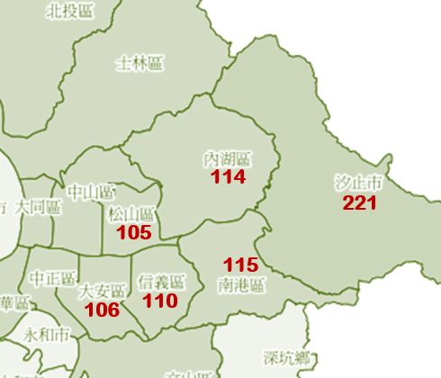

<br>

```{r echo=T, message=F, cache=F, warning=F}
rm(list=ls(all=T))
pacman::p_load(magrittr, readr, caTools, ggplot2, dplyr, vcd)
```
<br>

##### 1.1 讀進資料
```{r}
TA = read_csv("data/ta_feng_all_months_merged.csv") %>% 
  data.frame %>% setNames(c(
    "date","cust","age","area","cat","prod","qty","cost","price"))
```
<br>


##### 日期格式轉換
```{r fig.height=3.2, fig.width=7}
TA$date = as.Date(TA$date, format="%m/%d/%Y")
par(cex=0.8)
hist(TA$date,'week',freq=T,las=2) #以週為單位畫出直方圖
```
<br>

##### 年齡層級、郵遞區號
```{r}
age.group = c("<25","25-29","30-34","35-39","40-44",
              "45-49","50-54","55-59","60-64",">65") # 將年齡分類
TA$age = c(paste0("a",seq(24,69,5)),"a99")[match(TA$age,age.group,11)] # seq函數將年齡24-69歲以5歲間隔產生 
#paste0函數將a與數字合併 match函數：匹配两个向量，返回Z$age在age.gropu的位置。
TA$area = paste0("z",TA$area)
```
<center>

</center>
```{r fig.height=2.5, fig.width=7}
par(mfrow=c(1,2),cex=0.7)
table(TA$age, useNA='ifany') %>% barplot(main="Age Groups", las=2) #useNa = >將NA視為有效類別
table(TA$area,useNA='ifany') %>% barplot(main="Areas", las=2)
```
<br>

##### 處理離群值
```{r}
# Quantile of Variables
sapply(TA[,7:9], quantile, prob=c(.99, .999, .9995))
```

```{r}
# Remove Outliers
TA = subset(TA, qty<=24 & cost<=3800 & price<=4000) 
```
<br>

##### 彙總訂單 Assign Transaction ID
把每一天、每一位顧客的交易項目彙總為一張訂單
```{r}
TA$tid = group_indices(TA, date, cust) # same customer same day
```
<br>

##### 資料總覽
```{r}
# No. cust, cat, prod, tid
sapply(TA[c("cust","cat","prod","tid")], n_distinct)
```
<br><hr>

### 2. 交易計錄：`TRA`
<br>

##### 交易資料彙整
```{r}
TRA = TA %>% group_by(tid) %>% summarise(
  date = min(date),          # 交易日期  
  cust = min(cust),          # 顧客 ID
  age = min(age),            # 顧客 年齡級別
  area = min(area),          # 顧客 居住區別
  items = n(),               # 交易項目(總)數
  pieces = sum(qty),         # 產品(總)件數
  total = sum(price),        # 交易(總)金額
  gross = sum(price - cost)  # 毛利
) %>% data.frame
```
<br>

##### 處理離群值
```{r}
# Check Quantile & Remove Outliers
sapply(TRA[,6:9], quantile, prob=c(.999, .9995, .9999))
```

```{r}
# Remove Outliers
TRA = subset(TRA, items<=62 & pieces<95 & total<16000) # 119328
```
<br>

##### 交易摘要
```{r}
summary(TRA)    
```
<br><hr>

### 3. 顧客資料：`C`
<br>

##### 顧客資料彙整
```{r}
d0 = max(TRA$date) + 1
C = TRA %>% mutate(
  days = as.integer(difftime(d0, date, units="days"))# 新增欄位days為每張訂單的交易日期和資料的最後一天差幾天
  ) %>% group_by(cust) %>% summarise(
    r = min(days),      # recency
    s = max(days),      # seniority
    f = n(),            # frquency
    m = mean(total),    # monetary
    rev = sum(total),   # total revenue contribution
    raw = sum(gross),   # total gross profit contribution
    age = min(age),     # age group
    area = min(area),   # area code
  ) %>% data.frame      
```
<br>

##### Check & Save
```{r}
is.na(TA) %>% colSums
```

```{r}
is.na(TRA) %>% colSums
```

```{r}
is.na(C) %>% colSums
```

```{r}
save(TA, TRA, C, file="final_data/C_TRA.rdata")
```

<br><hr>